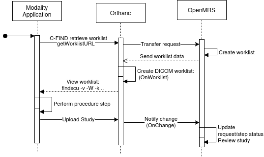
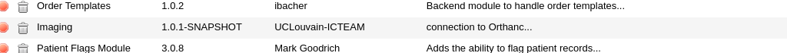
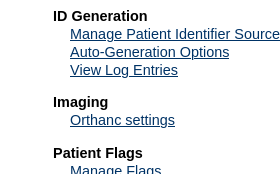

[](https://travis-ci.org/openmrs/openmrs-module-imaging)

OpenMRS CUSTOM Imaging Module

CUSTOMIZED the module for integrating OHIF explorer , medical reports ... for CHU Blida project .

find the original in [here](https://github.com/sadrezhao/openmrs-module-imaging/tree/main) .

======================
In order to improve the management of patient image data within OpenMRS, the open source electronic healthcare system,
we have developed an integration between Orthanc PACS and OpenMRS, initially designed for OpenMRS 2.x, the most widely used version of OpenMRS.
The first release for OpenMRS 3.x is available (## link to npm release 3), the next generation electronic medical record (EMR) system. This new module is focused on
simplifying the management of imaging data.

_CUSTOM_ :
Fixed the Imaging1.1.1-SNAPSHOT branch 04f... orthance url concatenation .

Watch the video demonstration of the module here: [](https://youtu.be/no3WNaq4Q_M)



This diagram illustrates the workflow of the worklist. A radiologist wants to view the worklist generated in OpenMRS via C-FIND Rest API
URL. The Orthanc server forwards the request to OpenMRS. OpenMRS processes the request and returns the worklist in JSON format. The Orthanc plugin function `Onworklsit`
reads the data and generates the worklist in DICOM format. The results can be viewed with the command like `findscu -v -W -k "ScheduledProcedureStepSequence[0].Modality=CT" 127.0.0.1 4242`.
When the radiologist performs the procedure, a new DICOM study is created and uploaded to the Orthanc server. The Orthanc plugin observes the new study using the
OnChange function, notifies OpenMRS to update the worklist status and marks the associated procedure step as completed.

# Preparing Othanc servers

The following is needed:

- An OpenMRS 2 backend server
- One or multiple Orthanc servers

## Deploying the imaging module

**This is a customised fork.** Do not download the upstream release — its artifact does not
contain the OHIF integration or the deletion-reconciliation fix. Build from this directory:

```bash
mvn clean package -DskipTests
```

The artifact is produced at `omod/target/imaging-1.2.0.omod`. With OpenMRS running, upload it
via **Administration → Manage Modules → 'Add or Upgrade Module'**; OpenMRS detects the
installed version and offers an upgrade. The upload may take some time. Keep a copy of the
previously installed `.omod` first — it is the only rollback path, since the artifact is not
in version control:

```bash
docker cp openmrs-app:/usr/local/tomcat/.OpenMRS/modules/<current>.omod ~/
```

If deployed successfully, it should appear in the list of loaded modules on your server:



Deploy OpenMRS Imaging module from it's directory by cloning the repository, navigating to the directory and running the following run command. This will automatically
deploy the module before the server is started. To streamline the process, add the following run configuration to your IDE to efficiently build, deploy and run the project.:

```bash
  mvn clean install openmrs-sdk:run -DserverId=myserver
```

## Configure the connection to the Orthanc servers

You must provide connection settings (IP address, username, etc.) in order to allow OpenMRS to reach the Orthanc server(s). If the imaging module
has been correctly deployed, you can access the connection settings on the administration page of your OpenMRS server:



## Configure your Orthanc servers

The imaging backend module provides an REST API service that the Orthanc servers need to contact to query and update the worklist.
Add the following lines to the configuration file of the Orthanc servers (typically the file `/etc/orthanc/orthanc.json`):

```bash
    "ImagingWorklistURL": "http://OPENMRSHOST:OPENMRSPORT/openmrs/ws/rest/v1/worklist/requests",
    "ImagingUpdateRequestStatus": "http://OPENMRSHOST:OPENMRSPORT/openmrs/ws/rest/v1/worklist/updaterequeststatus",`
    "ImagingWorklistUsername" : "OPENMRSHOSTUSER",`
    "ImagingWorklistPassword" : "OPENMRSHOSTPASSWORD"`
```

Replace OPENMRSHOST and OPENMRSPORT by the address and port of your OpenMRS backend server, and OPENMRSHOSTUSER and OPENMRSHOSTPASSWORD
by the name and password of an user account on the OpenMRS server that you have created for the Orthanc servers.

## Install the worklist plugin on the Orthanc servers:

The Orthanc servers act as worklist servers for the modalities. Our python plugin for Orthanc implements the needed functionality. Download
the python script from https://github.com/sadrezhao/openmrs-module-imaging/blob/main/python/orthancWorklist.py and place it in a directory
that is accessible by the Orthanc servers, for example in `/etc/orthanc`. Then add the following line to the python plugin configuration file
of Orthanc (typically the file `python.json` in `/etc/orthanc`):

```bash
  "PythonScript": "/etc/orthanc/orthancWorklist.py",
```

Then restart the Orthanc server:

```bash
  sudo systemctl restart orthanc
```

## Image Data Management

This is the heart of the Orthanc integration, allowing browsing and viewing of patient images through DICOM viewers available within Orthanc.
The module retrieves the metadata of image studies stored on Orthan servers. A mapping function helps associating OpenMRS patient records with their
corresponding studies. In addition, image data can be uploaded directly from the OpenMRS web client to Orthanc servers.

## Worklist without RIS

In the context of radiology, a worklist is a list of imaging studies or tasks that a radiologist needs to execute, review, or analyze.
These tasks are typically retrieved from a radiology information system (RIS), a specialized database that manages patient and imaging information.
However, in situations where an RIS system is not available or feasible (such as for smaller healthcare facilities, clinics, or specific locations),
a simple radiology worklist can be sufficient.

The Orthanc servers also act as DICOM worklist servers. Imaging procedure requests created in the frontend can be queried by modalities or the
radiology department from the Orthanc servers. When a DICOM study matching the `PerformedProcedureStepID` tag of a worklist procedure step is uploaded
to an Orthanc server, the Orthanc server will notify the OpenMRS server and the status of the procedure step will change in the frontend.

### Testing the worklist

First, create some new imaging requests in the front end. The DCMTK findscu tool from https://support.dcmtk.org/docs/findscu.html allows to query the resulting
DICOM worklists from the Orthanc server (replace 127.0.0.1 by the IP address of the Orthanc server):

```bash
  findscu -v -W -k "ScheduledProcedureStepSequence[0].Modality=CT" 127.0.0.1 4242     # Query by modality

  findscu -v -W -k "PatientID=PatientUuid" 127.0.0.1 4242  # Query by patient data

  findscu -v -W -k "ScheduledProcedureStepSequence[0].RequestedProcedureDescription=xxx" 127.0.0.1 4242 # Query by requested procedure description
```

If you want to generate a `.wl` file, uncomment the following lines from the python plugin:

```bash
# This code only for test:`
  # Save the DICOM buffer to a file`
  # with open("/tmp/worklist_test.wl", 'wb') as f:
  # f.write(responseDicom)`
```

---

# medreport integration (1.1.2-SNAPSHOT)

This module owns **images**, not reports. Report writing, reading, versioning, permissions and
auditing all live in the separate `medreport` module. What this module contributes is two
entry points and one boolean.

### The whole change

| File | Change |
| --- | --- |
| `StudiesPageController` | adds `medreportAvailable = ModuleFactory.isModuleStarted("medreport")` |
| `SeriesPageController` | the same, plus publishes `orthancStudyUID` |
| `studies.gsp` | a banner **above** the studies table linking to `medreport/imagingReports.page` |
| `series.gsp` | the same banner (scoped to the study), plus a per-row document icon that opens medreport's editor on that series |
| `messages*.properties` | one key, `imaging.app.writeReport.label` |

No report logic, no `medreport` dependency in any `pom.xml`, and every addition is wrapped in
`<% if (medreportAvailable) { %>`. **With `medreport` absent, these pages render exactly as
they did before.**

### Why a link and not an embedded panel

An earlier revision embedded medreport's reports panel at the *bottom* of `studies.gsp`. That
failed in two concrete ways: clinicians never scrolled past the studies table to find it, and
it vanished entirely on the "Get studies" navigation. A banner at the top pointing at
medreport's own page fixes both, and the per-series action has a stable target.

### If you edit these GSPs

Groovy's `SimpleTemplateEngine` has **no JSP comment syntax** — `<%-- … --%>` is a parse error
that surfaces as a full-page *UI Framework Error* to the clinician, and a `.gsp` is only
compiled when someone opens the page, so the build will not catch it. Use `<% /* … */ %>`.
`medreport`'s `GspTemplateParseTest` compiles every template in *that* module at build time;
this module has no equivalent, so review template edits carefully.

---

# OHIF integration (1.2.0)

This module owns the **link** to OHIF, not OHIF itself. The viewer is a separate
container fronted by its own reverse-proxy host; see
`../OHIF-Integration-Architecture.md` for the full transport, TLS and authentication
design. What this module contributes is one global property and one icon per study.

### The whole change

| File | Change |
| --- | --- |
| `ImagingConstants` | `GP_OHIF_BASE_URL = "imaging.ohifBaseUrl"` |
| `ImagingProperties` | `getOhifBaseUrl()` reads that global property |
| `config.xml` | declares `imaging.ohifBaseUrl`, default **empty** |
| `StudiesPageController` | publishes `ohifBaseUrl` to the model |
| `SeriesPageController` | the same |
| `SyncStudiesPageController` | the same — **added in 1.2.0** |
| `studies.gsp`, `series.gsp` | OHIF icon between Stone Viewer and Orthanc Explorer |
| `syncStudies.gsp` | the same icon — **added in 1.2.0** |
| `messages.properties`, `messages_pl.properties` | `imaging.app.openOHIFView.label` |
| `resources/images/ohifViewer.png` | the icon |
| `DicomStudyServiceImpl` | prunes studies deleted from Orthanc — **added in 1.2.0** |

The link is built as:

```
<imaging.ohifBaseUrl, trailing slash stripped>/viewer?StudyInstanceUIDs=<studyInstanceUID>
```

Every OHIF addition is wrapped in `<% if (ohifBaseUrl?.trim()) { %>`. **With the
property unset, these pages render exactly as they did before** — which is also why
nothing appears if you deploy the module without configuring it.

## Deployment — one required setting

After installing the `.omod`, set the global property at
**Administration → Maintenance → Settings → Imaging**:

```
imaging.ohifBaseUrl = https://viewer.hospital.lan
```

- No trailing slash (a trailing slash is stripped anyway) and **no leading or trailing
  whitespace** — the guard is `?.trim()`, so a whitespace-only value renders nothing and
  looks identical to not having set it.
- **Set it through the UI, not by SQL.** OpenMRS caches global properties in memory; a
  direct `UPDATE` on `global_property` leaves the running application serving the old
  value, so the button will not appear even though the database looks correct.
- The property is created automatically, empty, when the module starts.

Do **not** confuse this with the **Configuring the Orthanc server** page. That page edits
the `imaging_OrthancConfiguration` table (`orthancBaseUrl`, `orthancProxyUrl`,
credentials) and has nothing to do with OHIF. Changing `orthancBaseUrl` there breaks
uploads and study syncing.

## What 1.2.0 fixes

### 1. Studies deleted from Orthanc kept appearing in "Get studies"

`imaging_DicomStudy` is a **local mirror** of what Orthanc holds, and nothing pruned it:

- `fetchAllStudies(config)` called `createOrUpdateStudy` for every study Orthanc
  returned — create or update only, **never delete**.
- `fetchNewChangedStudies(config)` handles only `NewStudy` and `StableStudy` changes.

Handling a `Deleted` change type would **not** have fixed it. Orthanc's `/changes` log
contains no deletion events at all: change rows are tied to the resource and are removed
along with it. This was confirmed against a live server whose log held only `NewInstance`,
`NewSeries`, `NewStudy`, `StableStudy`, `StablePatient` and `UpdatedAttachment` entries
despite studies having been deleted.

**Reconciliation during a full fetch is therefore the only reliable mechanism.**
`fetchAllStudies(config)` now collects the `StudyInstanceUID`s Orthanc returned and calls
`removeStudiesDeletedFromOrthanc(config, uids)`, which removes local rows for that
configuration whose UID is absent.

> **This deletes patient-assigned records too.** A study removed from the PACS cannot be
> viewed — every link on it 404s — so keeping the row is misleading. Removals are logged:
> `log.info` normally, and **`log.warn`** when the row was assigned to a patient, naming
> the study UID and patient id, so the loss of a clinical association is auditable. If
> your site needs assigned studies preserved, change `removeStudiesDeletedFromOrthanc`
> to skip rows where `getMrsPatient() != null`.

Scope: only the configuration being fetched, so a multi-Orthanc setup will not have one
unreachable server prune another's studies. Nothing in the schema references
`imaging_DicomStudy`, so removal has no cascade effects.

The incremental poller (`fetchNewChangedStudies`) is unchanged and still cannot see
deletions — **"Get studies" is what reconciles them.**

### 2. The OHIF icon was missing on the "Get studies" page

Two independent omissions, both required:

- `SyncStudiesPageController.get()` never called
  `model.addAttribute("ohifBaseUrl", ...)`, unlike the studies and series controllers.
- `syncStudies.gsp` had no OHIF markup at all.

The icon appeared on a patient's own studies but vanished on studies fetched from the
PACS. Both are fixed, matching the existing pages exactly.

### If you edit these GSPs

Groovy's `SimpleTemplateEngine` has **no JSP comment syntax** — `<%-- … --%>` is a parse
error that surfaces as a full-page *UI Framework Error*, and a `.gsp` is compiled only
when someone opens the page, so the build will not catch it. Use `<% /* … */ %>`.

`syncStudies.gsp` uses **CRLF** line endings while the Java sources use LF. Preserve
them; a mixed-ending file produces confusing diffs.

The build runs `maven-java-formatter-plugin`, which **rewrites sources in place**. Expect
your formatting to be normalised, and re-read files after a build before diffing.
